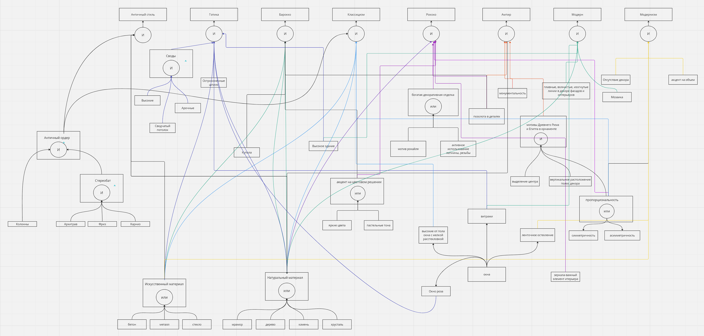

# Отчет по лабораторной работе

## по курсу "Искусственный интеллект"

### Студенты:

| ФИО                           | Роль в проекте | Оценка |
| ----------------------------- | -------------- | ------ |
| Романовцев Дмитрий Алексеевич | Писал проект   |        |

> _Комментарии проверяющих (обратите внимание, что более подробные комментарии возможны непосредственно в репозитории по тексту программы)_

## Тема работы

Для выполнения данной работы я решили выбрать тему "Архитектура". Я взял восемь популярных стилей, в которых были построены здания в разное время, и составили правила, с помощью которых можно определить один из них.

## Концептуализация предметной области

Выбранные стили - Античность, Готика, Барокоо, Классицизм, Рококо, Ампир, Модерн, Модернизм. У всех этих стилей есть общие и различные черты, из-за этого возникают трудности с определением конкретного. Например, витражи на окнах используются как в стие Модерн, так и в Готике. Для того, чтобы отличить их между собой, и был создан наш проект. Пользователю будут выдаваться какие-либо архитекрурные элементы, он отмечает, есть ли они в его здании. Так в результате опроса, он получит итоговый стиль.

Базу знаний мы решили оформить в виде дерева И/ИЛИ. По нему легко ориентироваться при написании программного кода, и составление занимает не много времени.

## Схема предметной области



## Принцип реализации системы

Экспертная система была реализована с помощью обратного вывода, так как он интуитивно понятен как пользователю, так и разработчику. В качестве системы программирования был выбран Python, потому что он имеет удобные внутренние функции, и его хорошо знает команда.

## Механизм вывода

Для представления правил и запросов определили несколько классов:

- Ask - вопрос, который необходимо задать пользователю. Также содержит набор возможных ответов
- If - правило или просто синтаксический сахар для хранения содержимого правила
- AND/OR - классы для представления ветвей дерева с пометкой И/ИЛИ. Они хранят список аргументов. Для упрощения кода вся функциональность определена в родительском классе Content

Правила базы знаний нашей системы записали как список фактов в виде пар атрибут-значение. Они представляют собой один большой словарь, который сопоставляет действия с условиями, выраженными в виде выражений И-ИЛИ.
Для удобства и единообразности факты были вынесены в класс констант. Например:

```python
class Consts:
    DEFAULT = "default"
    YES = "y"
    NO = "n"
    EXIT = "e"
    VAULTS = "Своды"
    ARCHS = "Арочные своды"
```

Таким образом, правила базы знаний нашей системы выглядят следующим образом:

```python
rules = {
    Consts.DEFAULT: Ask([Consts.YES, Consts.NO, Consts.EXIT]),
    Consts.VAULTS: IF(AND([Consts.ARCHS, Consts.HIGH, Consts.VAULTED_CEILING])),
    Consts.WINDOWS: Ask(
        [
            Consts.STAINED_GLASS,
            Consts.RIBBON_GLAZING,
            Consts.HIGH_WINDOWS_WITH_SHALLOW_GLAZING,
            Consts.ROSE_WINDOW,
        ]
    ),
    Consts.PROPORTIONALITY: Ask(
        [
            Consts.SYMMETRY,
            Consts.ANTISYMMETRY,
        ]
    ),
    Consts.NATURAL_MATERIAL: IF(
        OR([Consts.MARBLE, Consts.WOOD, Consts.STONE, Consts.CRYSTAL])
    ),
    Consts.ARTIFICIAL_MATERIAL: IF(OR([Consts.CONCRETE, Consts.GLASS, Consts.METAL])),
    Consts.EMPHASIS_ON_COLOR_SCHEME: IF(
        OR([Consts.BRIGHT_COLORS, Consts.PASTEL_COLORS])
    ),
    Consts.ANTIQUE_ORDER: IF(AND([Consts.COLUMNS, Consts.SREREOBAT])),
    f"{Consts.WINDOWS}:{Consts.ROSE_WINDOW},{Consts.STAINED_GLASS}": IF(
        AND([Consts.ROSE_WINDOW, Consts.STAINED_GLASS])
    ),
    f"{Consts.STYLE}:{Consts.GOTHIC}": IF(
        [
            Consts.VAULTS,
            Consts.POINTED_SPIRES,
            f"{Consts.WINDOWS}:{Consts.ROSE_WINDOW},{Consts.STAINED_GLASS}",
            Consts.ARTIFICIAL_MATERIAL,
            Consts.NATURAL_MATERIAL,
            Consts.HIGH_BUILDING,
        ]
    ),
    ...
}
```

Чтобы выполнить обратный вывод, определили класс Knowledgebase, содержащий в себе всю логику логического вывода. Он включает в себя:

- Working memory — словарь, сопоставляющий ключи со значениями
- rules - правила базы знаний в формате, определенном выше

Класс Knowledgebase имеет два основных метода:

- get - получает значение ключа.
- eval - выполняет фактический вывод, т.е. проходит по дереву И/ИЛИ и оценивает подцели

## Извлечение знаний и база знаний

Для извлечения знаний была создана доска в сервисе Miro. Это позволило находить и выписывать факты данной предметной области в любом удобном формате.

Далее была создана иерархическая система знаний в виде И/ИЛИ дерева, так как с помощью нее можно достаточно легко описывать комплексные системы.

Из схемы, представленной выше, можно увидеть, что были выделены правила, связанные с такими атрибутами зданий, как материал, преобладающие цвета, богатство отделки, а также характерные элементы того или иного стиля.

Также одними из преимуществ данного представления знаний являются простота его реализации и масштабируемость программного кода. Достаточно только один раз имплементировать алгоритм работы, а вся дальнейшая работа над системой будет сводиться к неограниченному добавлению новых правил.

## Протокол работы системы

Примеры работы системы:

1. Готика

```python
Отвечайте y или n, чтобы определить стиль здания
Арочные своды?
Введите один из вариантов ответа: y, n
y
Высокие своды?
Введите один из вариантов ответа: y, n
y
Сводчатый потолок?
Введите один из вариантов ответа: y, n
y
Остроконечные шпили?
Введите один из вариантов ответа: y, n
y
Окно роза?
Введите один из вариантов ответа: y, n
y
Витражи?
Введите один из вариантов ответа: y, n
y
Бетон?
Введите один из вариантов ответа: y, n
y
Мрамор?
Введите один из вариантов ответа: y, n
y
Высокое здание?
Введите один из вариантов ответа: y, n
y
Это Готика
```

2. Ампир

```python
Отвечайте y или n, чтобы определить стиль здания
Арочные своды?
Введите один из вариантов ответа: y, n
n
Монументальность?
Введите один из вариантов ответа: y, n
y
Позолота в деталях?
Введите один из вариантов ответа: y, n
y
Яркие тона?
Введите один из вариантов ответа: y, n
y
Это Ампир
```

3. Классицизм

```python
Отвечайте y или n, чтобы определить стиль здания
Арочные своды?
Введите один из вариантов ответа: y, n
n
Монументальность?
Введите один из вариантов ответа: y, n
n
Мрамор?
Введите один из вариантов ответа: y, n
y
Бетон?
Введите один из вариантов ответа: y, n
y
Пропорциональность?
Введите один из вариантов ответа: Симметричность, Асимметричность
y
Некорректный ввод. Повторите попытку.
Введите один из вариантов ответа: Симметричность, Асимметричность
Симметричность
Окна?
Введите один из вариантов ответа: Витражи, Ленточное остекление, Высокие окна с мелкой расстекловкой, Окно роза
Высокие окна с мелкой расстекловкой
Колонны?
Введите один из вариантов ответа: y, n
y
Стереобат?
Введите один из вариантов ответа: y, n
y
Это Классицизм
```

## Выводы

В ходе выполнения лабораторной работы над созданием экспертной системы для определения архитектурного стиля зданий, мы приобрели ценные навыки работы с базами знаний, онтологиями и алгоритмами машинного обучения. Этот опыт научил нас эффективно планировать и структурировать работу над сложными проектами. Мы осознали важность изначального эффективного планирования и структурирования проекта, поскольку приходилось вносить небольшие изменения в структуру, в процессе написания кода.

Одной из основных трудностей было создание иерархической системы знаний и выбор методов анализа данных из-за разнообразия стилей и архитектурных подходов. Несмотря на эти сложности, мы успешно справились с поставленными задачами благодаря регулярным совещаниям, обмену информацией и использованию методологий Scrum и Slack.

Наши ежедневные созвоны начинались с планирования, где определяли цели, задачи и время спринта. Затем мы активно работали над выполнением поставленных задач, и в конце созвона обсуждали проделанную работу и следующие шаги для завершения проекта.
